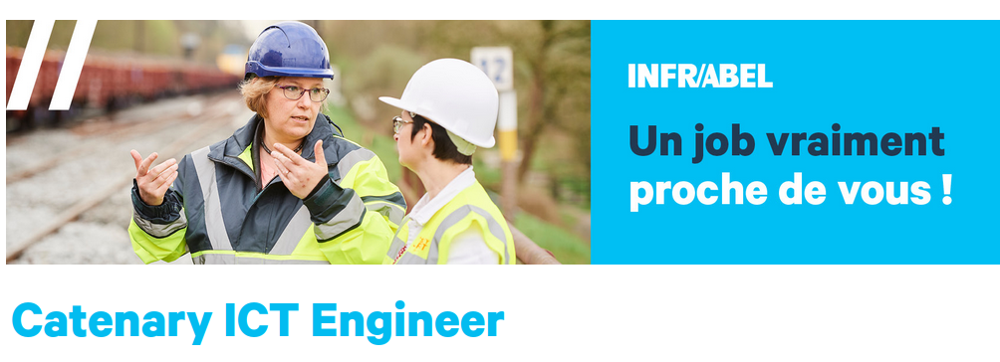

# Mijn profiel

<!--
Mijn profiel is vrij technisch, dus ik zal mijn ervaringen eenvoudig chronologisch presenteren.
-->

---

# mijn initiële opleiding

<!--
het eerste deel is mijn initiële opleiding.
-->

---
## bachelorstudent

- Bachelor in natuurkunde afgerond in 2009.
- Keuze voor natuurkunde als studie voort te zetten.

<!-- Adding extra lines to push content down -->
afgerond = fini
studie voortzetten 

<!--
Ik ben afgestudeerd aan mijn bachelor in natuurkunde in 2009. Daarna heb ik besloten om mijn studie in natuurkunde voort te zetten.
-->
---

## master student

- Specialisatie in laserfysica aan de Universiteit van Lund.
- afgerond om 2011

<!--
Aan de Universiteit van Lund in Zweden heb ik me gespecialiseerd in laserfysica omdat het een opkomende technologie was met vele toepassingen.
-->

&nbsp;
opkomend =émergent
toepassingen = utilisations

---

# mijn erste ervaringen

<!--
Ik zal spreken over mijn eerste professionele ervaringen.
-->
---

## werk bij ELI beamlines : 2014-2017
- Optical engineer in Praag

<!--
Von 2014 tot 2017, ik was optisch ingenieur in Praag. Het was een project van de Europese Unie om een laser met krachtige impulsen te bouwen.
-->
krachtige : puissant

---

# Mijn Terugkeer

- Positie gevonden
- wetenschapspark van Luik.

<!--
In 2017 wilde ik terugkeren naar de buurt van Frankrijk. Ik vond een positie in het wetenschapspark van Luik.
-->

&nbsp;

terugkeer - retour
wetenschapspark - science park

---
## werk bij AMOS: 2017-2020

- astronomische systemen.

<!--
Het bedrijf AMOS is een producent van unieke astronomische systemen. Het is een belangrijk bedrijf binnen de Waalse ruimtevaartindustrie.
-->

 
belangrijk : important
ruimtevaart: spatial

--- 
## Mijn job bij AMOS

- Moeilijke baan
- Metrologie rapporten maken

<!--
Het was een zware baan. Ik moest maximale optische kwaliteit bereiken en metrologierapporten maken. Dit vereiste veel geduld.
-->
&nbsp;

geduld: patience
bereiken : atteindre

---
## Mijn job bij AMOS

- spiegel moest voor meer dan een jaar gepolijst zijn.

<!--
Mijn werkplek werd gefilmd door een televisieploeg. Een voorbeeld hiervan is deze spiegel die meer dan een jaar moest worden gepolijst. Ik vond deze baan leuk, maar het was lastig om krassen of ongelukken te vermijden.
-->

filmploeg - 
gepolijst -
krassen -

---
## Om Copernicus

- geleerd over satellietbeeldvorming.
- Geïnteresseerd geraakt in werken met data.

<!--
Tijdens deze jaren leerde ik over een EU-programma voor aardobservatie, genaamd Copernicus. Sindsdien ben ik geïnteresseerd geraakt in het werken met data.
-->

&nbsp;
&nbsp;
satellietbeelden - satellite imaging
aardobservatie - earth monitoring

---
## terugkeren naar studies

- Baan verloren
- data science geleerd aan Universiteit van Luik.

<!--
Ik verloor mijn baan, maar ik kon data science leren aan de Universiteit van Luik. Ik vond het zeer interessant.
-->

&nbsp;
&nbsp;
datawetenschap - data science

---

## 2020-2022 mijn informatika studies ervaring

- Niet alle cursussen afgerond, codeerde niet snel genoeg.
- Overgestapt naar een meer toegepaste codingschool.

<!--
Ik heb niet alle cursussen in het programma afgerond omdat ik niet snel genoeg codeerde. Daarom ben ik overgestapt naar een meer toegepaste codingschool.
-->

&nbsp;
&nbsp;
overstappen - bifurquer

---
# Nu

- data scientist posities
- Natuurkundebasis vorkeur

<!--
Ik solliciteer nu voor data scientist posities. Ik geef de voorkeur aan banen die mijn achtergrond in natuurkunde gebruiken. In de volgende slides zal ik voorbeelden geven.
-->

 
 
&nbsp;
&nbsp;
voorspellende: prédictive
achterground : background
voorkeur : preference

---
## voorbeeld 1

<!--
Het Waalse agronomisch onderzoekscentrum bood een baan aan om data te analyseren. Bodemgegevens en weergegevens helpen boeren betere opbrengsten te behalen..
-->

Bodemgegevens: données du sol
weergegevens: données météo
opbrengsten : rendements

---

## voorbeld 2

<!--
Vorige week heb ik gesolliciteerd bij Infrabel.
Gegevens helpen het onderhoud te verbeteren.
-->
onderhoud : maintenance

---

## Wat ik zou moeten doen

- projectportfolio hebben
- netwerken

<!--
Ik moet een projectportfolio hebben en mijn netwerk uitbreiden. Bijvoorbeeld, tijdens deze bijeenkomst in Leuven.
-->

 
uitbreiden 
bijenkomst : meetup